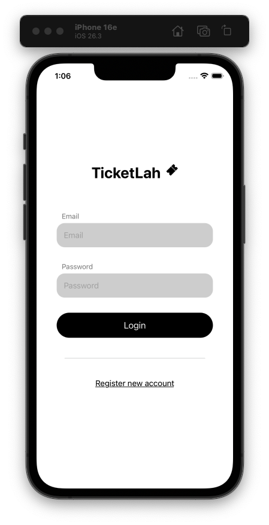
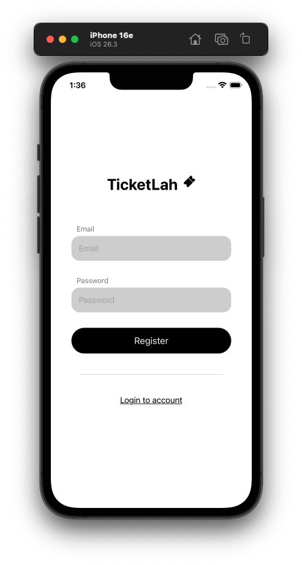
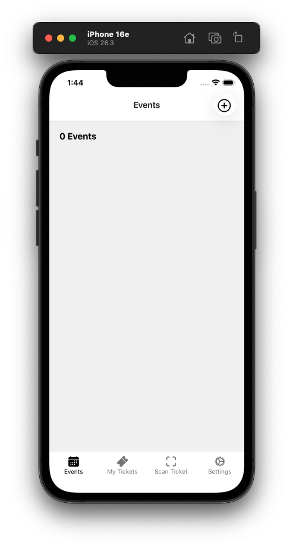
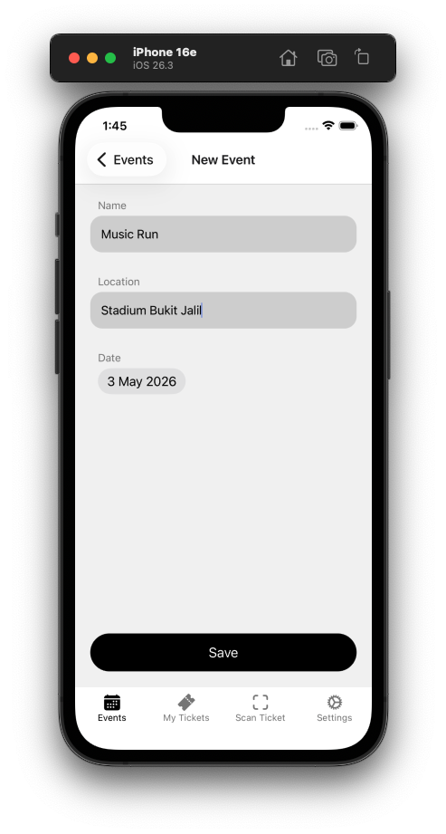
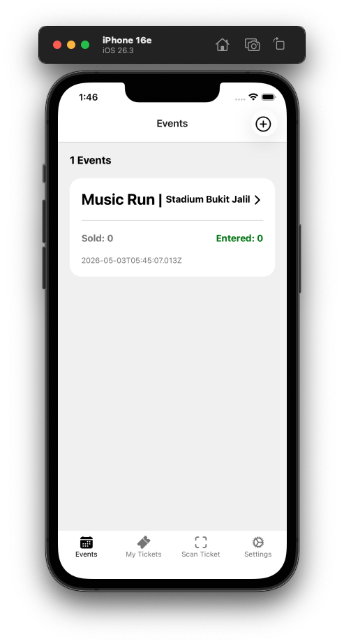
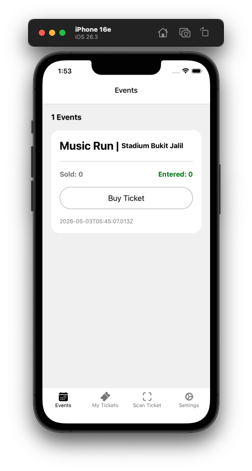
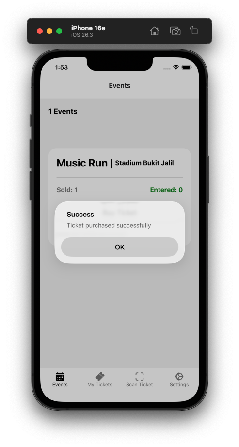
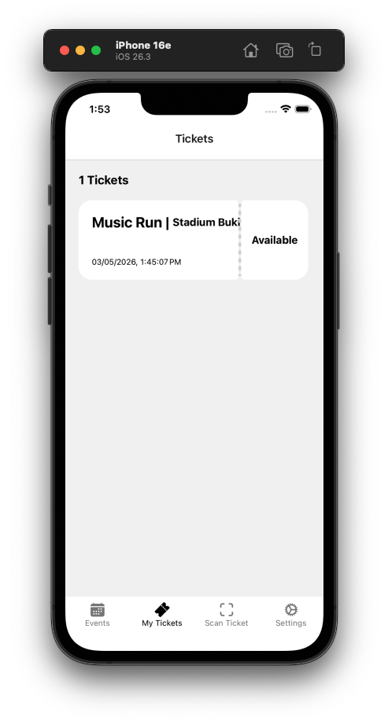
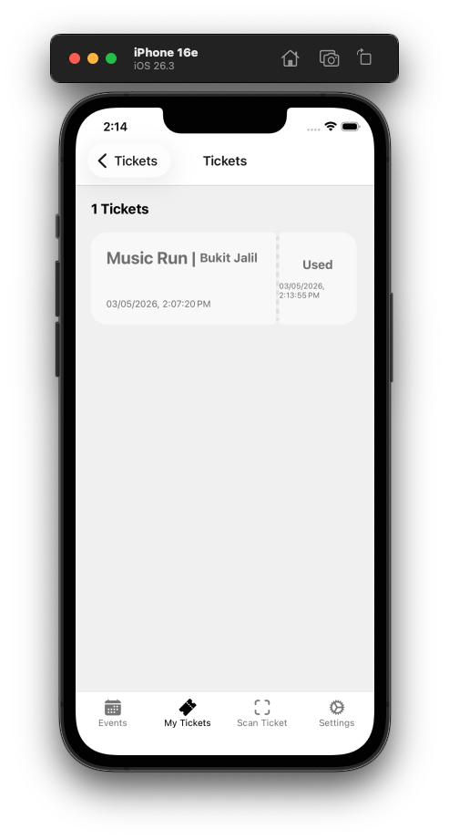

<p align="center">
  <h1 align="center">🎫 TicketLah</h1>
  <p align="center">
    A full-stack mobile event ticketing platform built with <strong>React Native (Expo)</strong> and <strong>Go (Fiber)</strong>.
    <br />
    Managers create events, attendees buy tickets, and entry is validated via QR code scanning — all in one app.
  </p>
</p>

<p align="center">
  
  
  
  
  
  
  
</p>

---

## 📸 App Demo

### Authentication
Users can log in or register a new account. The first registered user is automatically promoted to the **Manager** role.

<p align="center">
  
  &nbsp;&nbsp;
  
</p>

### Manager Flow — Event Management
Managers can create, edit, and delete events. Each event card shows real-time ticket sales and check-in counts.

<p align="center">
  
  &nbsp;&nbsp;
  
  &nbsp;&nbsp;
  
</p>

### Attendee Flow — Ticket Purchase & Check-In
Attendees browse events, purchase tickets instantly, view their tickets with QR codes, and get validated at the door.

<p align="center">
  
  &nbsp;&nbsp;
  
</p>

<p align="center">
  
  &nbsp;&nbsp;
  
</p>

---

## ✨ Features

| Feature | Description |
|---|---|
| 🔐 **JWT Authentication** | Secure login & registration with bcrypt password hashing and token-based auth |
| 👥 **Role-Based Access** | Two user roles — **Manager** (CRUD events, scan tickets) and **Attendee** (buy tickets, view QR) |
| 📅 **Event Management** | Full CRUD for events with name, location, and date fields |
| 🎟️ **Ticket Purchasing** | One-tap ticket buying with real-time inventory tracking |
| 📱 **QR Code Generation** | Server-side QR code generation with encoded ticket + owner data |
| 📷 **QR Code Scanning** | Native camera integration for scanning & validating tickets at entry |
| 🔄 **Real-Time Stats** | Live ticket sold/entered counts computed per event via GORM hooks |
| 💾 **Persistent Sessions** | AsyncStorage-backed auth sessions with automatic login restoration |

---

## 🏗️ Architecture

```
TicketLah/
├── backend/                    # Go REST API
│   ├── cmd/api/main.go         # Entrypoint — Fiber app bootstrap
│   ├── config/                 # Environment config (godotenv + env parsing)
│   ├── db/                     # PostgreSQL init + GORM auto-migration
│   ├── models/                 # Domain models + repository/service interfaces
│   ├── repositories/           # Data access layer (GORM queries)
│   ├── services/               # Business logic (auth with JWT + bcrypt)
│   ├── handlers/               # HTTP handlers (Fiber route controllers)
│   ├── middlewares/             # JWT auth guard middleware
│   ├── utils/                  # JWT token generation utility
│   ├── Dockerfile              # Multi-stage Go build
│   ├── docker-compose.yaml     # App + PostgreSQL orchestration
│   └── Makefile                # Dev commands (start/stop)
│
├── mobile/                     # React Native (Expo) app
│   ├── app/                    # Expo Router file-based routing
│   │   ├── _layout.tsx         # Root layout with AuthProvider
│   │   ├── login.tsx           # Login/Register screen
│   │   └── (authed)/           # Protected routes (redirect if !logged in)
│   │       └── (tabs)/         # Bottom tab navigation
│   │           ├── (events)/   # Events tab (list, create, edit/delete)
│   │           ├── (tickets)/  # My Tickets tab (list, detail + QR code)
│   │           ├── scan-ticket/# QR scanner (CameraView + barcode parsing)
│   │           └── settings    # Settings (logout)
│   ├── components/             # Reusable UI (Button, Input, Stack, etc.)
│   ├── context/                # React Context (AuthContext with AsyncStorage)
│   ├── services/               # API service layer (Axios + interceptors)
│   ├── types/                  # TypeScript type definitions
│   └── styles/                 # Shared style shortcuts
│
└── screenshots/                # App demo screenshots
```

### Backend Design Pattern

The backend follows a **clean layered architecture**:

```
Request → Handler → Service → Repository → PostgreSQL
```

- **Handlers** — Parse HTTP requests, validate input, return JSON responses
- **Services** — Contain business logic (password hashing, JWT generation, email validation)
- **Repositories** — Encapsulate all database queries via GORM
- **Models** — Define domain entities and Go interfaces for dependency inversion
- **Middleware** — Extracts and validates JWT from `Authorization: Bearer <token>` headers

### Mobile Architecture

The mobile app uses **Expo Router** (file-based routing) with a structured separation of concerns:

- **Context** — Global auth state management with `useAuth()` hook
- **Services** — Axios-based API client with automatic token injection via interceptors
- **Types** — Shared TypeScript interfaces mirroring backend models
- **Components** — Reusable primitives (`VStack`, `HStack`, `Button`, `Input`) with shortcut-based styling

---

## 🔌 API Endpoints

### Public Routes

| Method | Endpoint | Description |
|---|---|---|
| `POST` | `/api/auth/login` | Authenticate with email & password → returns JWT + user |
| `POST` | `/api/auth/register` | Create a new account → returns JWT + user |

### Protected Routes (requires `Authorization: Bearer <token>`)

| Method | Endpoint | Description |
|---|---|---|
| `GET` | `/api/event/` | List all events (with ticket stats) |
| `GET` | `/api/event/:eventId` | Get single event details |
| `POST` | `/api/event/` | Create a new event |
| `PUT` | `/api/event/:eventId` | Update an event |
| `DELETE` | `/api/event/:eventId` | Delete an event |
| `GET` | `/api/ticket/` | List current user's tickets |
| `GET` | `/api/ticket/:ticketId` | Get ticket detail + QR code (base64 PNG) |
| `POST` | `/api/ticket/` | Purchase a ticket for an event |
| `POST` | `/api/ticket/validate` | Validate a ticket via QR scan (mark as entered) |

---

## 🛠️ Tech Stack

### Backend
| Technology | Purpose |
|---|---|
| **Go 1.25** | Core language |
| **Fiber v2** | High-performance HTTP framework |
| **GORM** | ORM with PostgreSQL driver + auto-migration |
| **PostgreSQL (Alpine)** | Relational database |
| **JWT (golang-jwt/v5)** | Token-based authentication |
| **bcrypt** | Secure password hashing |
| **go-qrcode** | Server-side QR code generation |
| **Docker Compose** | Container orchestration with health checks |

### Mobile
| Technology | Purpose |
|---|---|
| **React Native 0.81** | Cross-platform mobile framework |
| **Expo SDK 54** | Development tooling & native modules |
| **Expo Router v6** | File-based routing with nested layouts |
| **TypeScript 5.9** | Type-safe development |
| **Axios** | HTTP client with request/response interceptors |
| **AsyncStorage** | Persistent token & session storage |
| **expo-camera** | Native camera for QR code scanning |
| **React Navigation** | Tab & stack navigation |

---

## 🚀 Getting Started

### Prerequisites

- [Docker](https://docs.docker.com/get-docker/) & Docker Compose
- [Node.js](https://nodejs.org/) (v18+)
- [Bun](https://bun.sh/) (or npm/yarn)
- [Expo CLI](https://docs.expo.dev/get-started/installation/)
- iOS Simulator (Xcode) or Android Emulator

### 1. Clone the Repository

```bash
git clone https://github.com/TeeHaoBin/TicketLah.git
cd TicketLah
```

### 2. Start the Backend

```bash
cd backend
cp .env.example .env    # Configure your environment variables
make start              # Builds & starts Go app + PostgreSQL via Docker Compose
```

The API will be available at `http://localhost:3000`.

### 3. Start the Mobile App

```bash
cd mobile
bun install             # Install dependencies
bun run ios             # Launch on iOS Simulator
# or
bun run android         # Launch on Android Emulator
```

> **Note:** The mobile app automatically detects the dev server's IP address via Expo's `hostUri`, so it works seamlessly on both simulators and physical devices on the same Wi-Fi network.

### Environment Variables

Create a `.env` file in the `backend/` directory:

```env
SERVER_PORT=3000
DB_HOST=db
DB_NAME=ticketlah
DB_USER=postgres
DB_PASSWORD=secret
DB_SSLMODE=disable
JWT_SECRET=your-secret-key
```

---

## 📝 License

This project is open source and available under the [MIT License](LICENSE).
